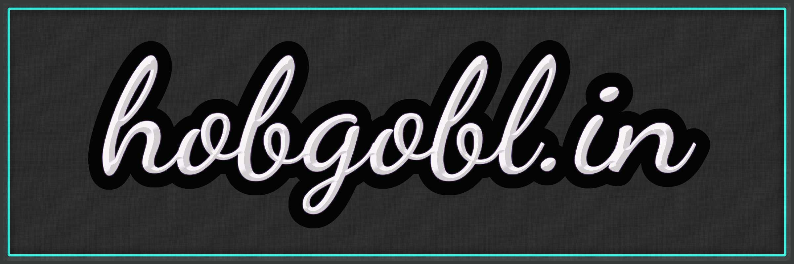

 

A simple project blog 
- python/flask back end
- css/html front end 
- markdown for easy content generation

---

<a href='https://www.hobgobl.in'>index<a> | <a href='https://www.hobgobl.in/blog'>blog<a> | <a href='https://www.hobgobl.in/bin'>bin</a> | <a href='https://www.hobgobl.in/info'>info</a> 

--- 

See specific files for their licenses, project is unlicensed though a majority of components are released under gpl3.
